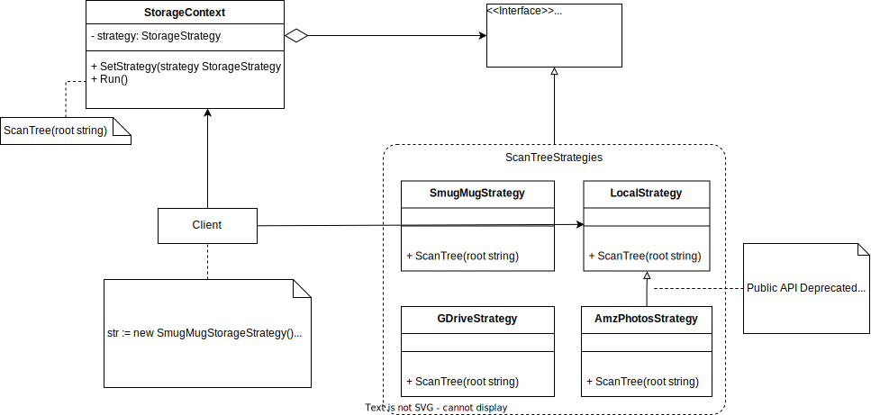

# File Sage Coalesces Your Digital Diaspora
`file-sage` is a modular Go application for managing digital content scattered across disparate cloud services and local storage.

# Purpose, Motivation, and Background
This project was inspired by my need to analyze and coalesce the vast digital diaspora of photos, videos, documents, and code stored "all over the place".

The evolution and proliferation of cloud and open-source storage and web technologies over the past few decades has made it easy and ever-cheaper to automate backups of the digital content from our devices.

The same technical and market forces that drove the commoditization of cloud storage unfortunately had the negative effect of creating proprietary siloes around ones data, designed to lock the customer into a vendor's ecosystem.

I suspect that such poor digital stewardship is commonplace, but have been surprised by the apparent lack of open-source or proprietary projects to solve this problem.

## Origins and `smugmug-backup`
My original scope was limited to photos and videos, which I had backed up in various places over the years. Before Amazon Photos came along with free unlimited storage, I was using SmugMug exclusively for this. `smugmug-backup` provided a way to "backup the backup," and provided a good example of using the SmugMug api to walk gallery trees and download their contents. Not wanting to "make this a project," originally, I thought I would just tweak `smugmug-backup` to create the analytics I desired while creating a local backup. I wasn't a "Go Developer" yet, so I began [solving the immediate problem as fast as possible in my native tongue at the time, python](https://github.com/tommyblue/smugmug-backup/issues/21).

When I returned to the problem some years later, I had recently "picked up Go" over a weekend's reading, and was motivated to "have a Go" at applying what I'd learned. Empowered by new insights from a better understanding of Go codebases, packaging ecosystem, and tooling, I was able to imagine solutions that were more performant, secure, and extensible.

Also, since I now had files "all over the place," I was looking at the problem from a higher vantage point, seeing the need for proper abstractions for the authentication and the disparate APIs for cloud and local storage services.

With these in mind, I decided to create `file-sage`/`whupdedup`.

## Survey of Existing Solutions for Multicloud Storage Management
There are numerous Free and OpenSource (FOSS) and proprietary Software-as-a-Service (SaaS) solutions for multi-cloud storage management for enterprise and personal use. The list is seemingly endless, and as more and more individuals and businesses move towards multicloud strategies, its growth accelerates.

Below I've called out my "notable mentions" from my non-exhaustive survey of these solutions, focusing on the core competency of multicloud abstraction and analytics to provide insights to help a user better organize their "digital diaspora".

### FOSS/SaaS: [`mist`](https://github.com/mistio/mist-ce) - Cloud Resource Management and Monitoring Platform

### FOSS/SaaS: [ManageIQ](https://www.manageiq.org) - Cloud Resource Discovery, Management and Monitoring Platform

### SaaS: [Multicloud Storage Manager](https://www.multcloud.com)

### SaaS: [Unifi Cloud](https://unifidrive.com)

### SaaS: [CloudMounter](https://cloudmounter.net/)

### SaaS: [Wasabi](https://wasabi.com), [Seagate MC](https://www.seagate.com/solutions/cloud/multicloud), [NetApp](https://bluexp.netapp.com/ontap-cloud) et al

### SaaS: [Whoopdedupe](https://www.whoopdedupe.com/about.html)
Whoopdedupe is a file deduplication service for Political and Union Orgs and NGOs.

## Survey of Multicloud Abstractions in the Go Ecosystem
Here I list the Go packages and applications relevant to the major areas of my DIY solution.

The vision of supporting arbitrary local or remote storage APIs, it was clear that abstractions were needed to support an extensible and maintainable codebase. The design pattern here is called the Strategy Pattern. The major strategies here to be modeled are Multicloud Authentication and API Abstraction.

### [`go-cloud`/`wire`](https://github.com/google/go-cloud) - Go Cloud Development Toolkit
This! Go-code-generation framework for building customized abstractions around arbitrary number of APIs. Although, note that it's actually [wire](https://github.com/google/wire/blob/main/docs/guide.md) that's doing the magic under the hood of generating code any injecting dependencies.

### [`goth`/`gothic`](https://github.com/markbates/goth) - Authentication-specific abstractions

### [CloudMuX](https://github.com/yunionio/cloudmux)

### [Crossplane](https://github.com/crossplane/crossplane)
My original intent was just to develop a Go application to serve my needs. Considering that:

    1. Go applications easily compile on all major platforms, therefore "run anywhere"
    2. "Running anywhere" is a primary goal for "cloud-native", and that
    3. Crossplane exists to unify APIs by mapping them onto kubernetes control plane(s)..

I realized that _a cloud-native, kubernetes-based solution could_:

    1. Leverage crossplane for most of the "heavy-lifting" in the implementation behind the multicloud abstractions needed.
    2. Use a forward-looking technology stack not likely to be obsolete any time soon, which also paves a simple path to migrating this to my own SaaS if desired.
    3. Extend my experience working with local kubernetes development tools, distributing and running applications via kubernetes running anywhere.

Hmmm... this approach would mean that I wouldn't have to reinvent so many multicloud abstraction wheels. Instead of implementing my own abstractions in Go using the [Strategy Pattern described below](#strategy-pattern-for-decoupling-storage-providers-from-application-logic), I would implement Crossplane Compositions (XRs) that would declaratively define these abstractions as kubernetes Custom Resource Definitions (CRDs), which would be analogous to the strategy interfaces and struct types in the Go Strategy Pattern. A FileTree XR, e.g. could be defined as a high-level kubernetes manifest (CRD) which describes all the parameters required by the business logic of my application: paths/URLs(which could imply the StorageStrategy (local, GDrive, Smugmug...)), file sizes, hashes, and other metadata to be gleaned. This XR/CRD fully _kubernetizes_ the interface to to my application, which would be just another pod running in a kubernetes cluster. Under the hood, the Crossplane XR is designed to dynamically use the appropriate Crossplane _Provider_ to implement each strategy, e.g. fetch a full listing of file paths in the tree.

After these XRs have been applied to the cluster (analogous to installing a library), my application would create, configure and apply a _claim_ including that XR (analogous to calling the library). Everything would be asynchronous and able to fully leverage the sophisticated toolset of the surrounding kubernetes ecosystem.

### [IBM Cloud AppID](https://www.ibm.com/cloud/blog/adding-sign-in-to-multicloud-applications-without-code-changes) - Multicloud ID Federation with Centralized IBM Cloud AppID

## Deduplication: General Data and File Processing Libraries
    * [`filededup`](https://github.com/HankB/filededup) - Go App for Hard-Linking Duplicate Files on Disk
    * [`dedup`](https://github.com/klauspost/dedup) - Go Package for Deduplicating I/O Streams

### Deduplication: Image and Video
    * https://github.com/qarmin/czkawka
    * https://github.com/arsenetar/dupeguru/
    * https://github.com/ermig1979/AntiDupl
    * https://github.com/Farmadupe/vid_dup_finder
    * https://github.com/PierreCrette/VideoDedup3
    * https://github.com/0x90d/videoduplicatefinder
    * https://github.com/ivandokov/phockup
    * https://github.com/idealo/imagededup
    * https://theophanemayaud.github.io/video-simili-duplicate-cleaner
    * https://github.com/jmathai/elodie
    * https://shotkit.com/best-duplicate-photo-finder/
    * https://www.ccleaner.com/business/ccleaner-cloud
    * https://www.easyduplicatefinder.com/duplicate-video-finder.html
    * https://www.easyduplicatefinder.com/find-duplicate-photos.html?tag=adword_edf&crtag=adwords
    * https://www.ashisoft.com/blog/top-5-best-duplicate-photo-finder-to-delete-duplicate-photos/
    * https://www.duplicatecleaner.com/
    * http://www.visipics.info/index.php?title=Main_Page
    * https://www.alldup.de/en_index.php
    * https://www.techpout.com/best-duplicate-photo-finder-and-cleaner-software/
    * https://tilores.io/content/basics-of-entity-resolution
    * https://community.mylio.com/spaces/9298803/feed
    * https://journals.sagepub.com/doi/10.1177/1550147717694172
    * https://www.mindgems.com/products/VS-Duplicate-Image-Finder/VSDIF-About.htm
    * https://www.starwindsoftware.com/starwind-deduplication-analyzer
    * https://macpaw.com/gemini
    * https://antitwin.org/en/
    * http://www.joerg-rosenthal.com/en/antitwin/similar.html
    * https://video-comparer.com/
    * https://photostructure.com/faq/what-do-you-mean-by-deduplicate/

### Storage Synchronization

#### [`rclone`](https://github.com/rclone/rclone) - `rsync` for Cloud Storage
By supporting `rsync` operations from any local or cloud storage provider to any other, `rclone` would seem to inherently solve the majority of the problems that `file-sage` faces.

*Cons:*
* It appears that `rclone` doesn't fill in missing API support across it's providers, i.e. many providers don't support "Recursive Listing" operation, which is a bit of a show-stopper here.
* Also, It doesn't seem to support fetching metadata-only, e.g. hashes, filenames, etc..
* I'd be tied to the [rclone configuration methodology](https://rclone.org/docs/#configure) and [config file](https://rclone.org/docs/#config-config-file).
* `rclone` is quite large and bloated.

*Approaches:*
* Newer - Build/spawn `librclone` as local rclone RPC server
    * gives you in memory access to the rc server which can be considered stable
    * If using the kubernetes approach, this server could just be another pod or perhaps another container in same pod.
* Older - Directly using rclone packages:
    * https://forum.rclone.org/t/need-example-rclone-copy-using-golang/19121/7
        * Using rclone packages directly, must Make sure you either vendor rclone or use go modules to pin the version as the backend interface can change.

### Application Configuration

#### `viper`/`cobra`
Probably best-inc-class, feature-wise, but heavyweight. Excellent integration between CLI args, config file options and env vars.

#### `kong`/`kongcomplete`
One of many lighterweight alternatives to viper.

# Design Elements

## Strategy Pattern for Decoupling Storage Providers from Application Logic

